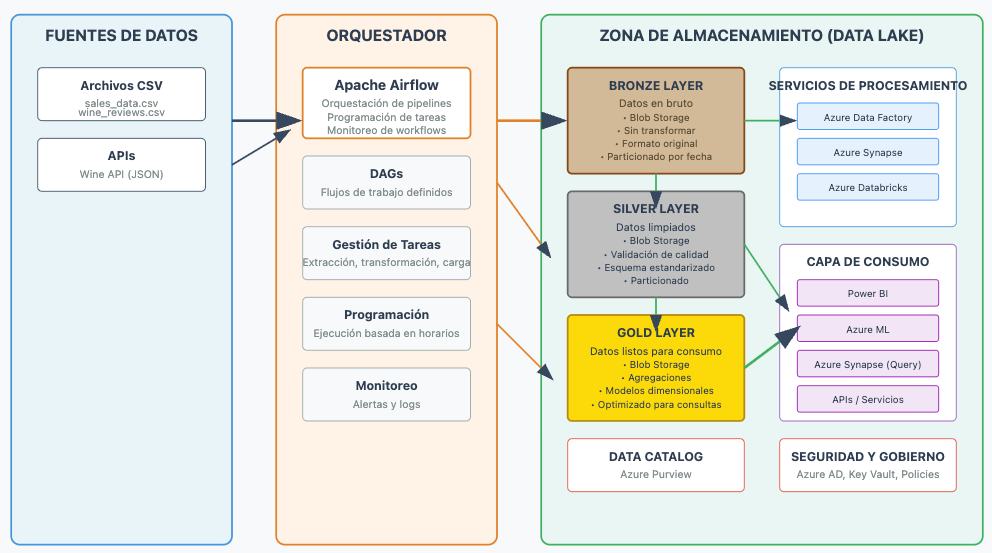

# Proyecto Data Engineer

## 📌 Problemática y Solución General

La empresa de vinos **ACME**, en su proceso de expansión, enfrenta tres desafíos clave:

1. **Recomendaciones personalizadas de vino**  
   Los clientes se sienten abrumados al elegir entre cientos de opciones. Se propone un sistema de recomendación que utilice datos históricos, precios y reseñas para ofrecer sugerencias personalizadas.

2. **Optimización del catálogo de productos**  
   El catálogo actual presenta productos similares y otros con baja rotación. Se busca analizar su rendimiento (por tipo, país, precio y reseñas) para tomar decisiones de inventario más eficientes.

3. **Automatización del análisis de reseñas**  
   Las reseñas textuales dificultan un análisis manual a gran escala. Se propone aplicar técnicas de procesamiento de lenguaje natural (NLP) para extraer patrones y mejorar las estrategias de marketing y recomendación.

---

## 🧠 Solución General: Implementación de un Data Lake

Para abordar estos retos, se ha diseñado una arquitectura basada en un **Data Lake**, que centraliza y estandariza los datos de diversas fuentes, permitiendo su análisis y explotación eficiente.

### 🔧 Arquitectura conceptual

- **Fuentes de datos**: Reseñas, historial de ventas, precios, inventario, etc.
- **Orquestador**: [Apache Airflow](https://airflow.apache.org/) gestiona la carga y transformación diaria de datos.
- **Data Lake**: Almacena los datos crudos y procesados en Azure Blob Storage.

Esta solución permite generar reportes, dashboards, recomendaciones y análisis automatizados a gran escala para apoyar la toma de decisiones estratégicas.

## 👥 Integrantes del Grupo

- Giancarlo Poémape  
- Robert Buleje 
- Diana Sánchez   
